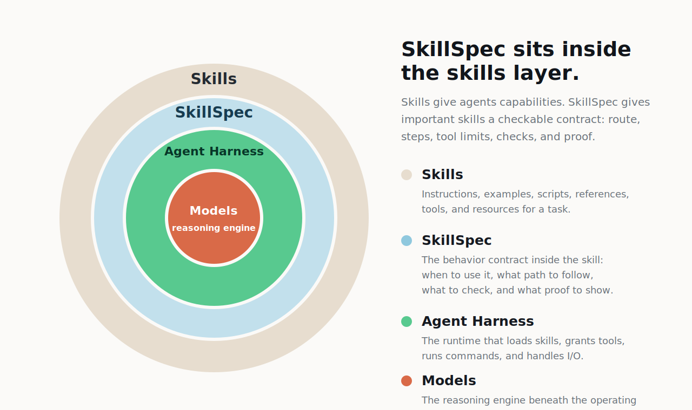

<p align="center">
  
</p>

# Skills that agents can actually follow

[](https://github.com/modiqo/skillspec/actions/workflows/ci.yml)

SkillSpec is a CLI plus a structured skill plan.

It keeps your normal `SKILL.md`, but adds a small `skill.spec.yml` beside it so
an agent knows when to use the skill, what path to follow, what checks must
pass, and what proof should exist at the end.

No new agent runtime. No orchestration platform. Just a contract that makes a
skill easier to follow, test, port, route, and review.

## Do Any Of These Sound Familiar?

- You wrote a powerful skill, but you still have to wonder: did the agent
  actually follow it?
- Your `SKILL.md` has step-by-step instructions, examples, scripts, code blocks,
  or extra files, and the agent sometimes reads the wrong part or skips the
  important part.
- Your skill keeps getting longer because every miss becomes another paragraph
  of instructions.
- You need the same skill to behave the same way in Codex, Claude, Agents, or
  another harness.
- You need to know whether the agent picked the right route before it started
  doing work.
- You need the agent to check dependencies before acting.
- You need tool boundaries: this skill may run these commands, but not those.
- You need proof after the run: selected route, completed steps, missing
  evidence, blocked checks, token economy, and final alignment.
- You have a repo of skills that reference each other, and it is unclear whether
  it is one skill, many skills, or a plugin-shaped system.
- You have too many installed skills and the harness starts shortening
  descriptions or spending context on the wrong ones.
- You want to turn a guided expert workflow into a reusable skill without
  rewriting tacit knowledge from memory.

If even two of these sound familiar, SkillSpec is probably for you.

## Install

Install the CLI first:

```sh
cargo install skillspec
skillspec --version
```

To install unreleased `main`, use:

```sh
cargo install --git https://github.com/modiqo/skillspec --package skillspec --force
skillspec --version
```

From a local repo checkout, use:

```sh
cargo install --path crates/skillspec-cli --force
skillspec --version
```

Then install the `skillspec` plugin into your harness.

Claude Code:

```sh
claude plugin marketplace add modiqo/skillspec --sparse .claude-plugin plugins/skillspec
claude plugin install skillspec@skillspec
claude plugin list
```

Claude installs the plugin enabled by default in current Claude Code builds. If
`claude plugin list` shows it disabled, run `claude plugin enable skillspec`.

Codex:

```sh
codex plugin marketplace add modiqo/skillspec --ref main --sparse .agents --sparse plugins/skillspec
codex plugin add skillspec@skillspec
```

Codex does not have a separate plugin enable command; `codex plugin add`
installs the plugin from the configured marketplace snapshot.

For local development, you can still install the skill folder directly:

```sh
# Codex
skillspec install skill skills/skillspec --target codex --retire-existing

# Agents
skillspec install skill skills/skillspec --target agents --retire-existing

# Claude local project
skillspec install skill skills/skillspec --target claude-local --retire-existing
```

After that, stay in chat and ask for outcomes:

```text
/skillspec run doctor on ./my-skill
/skillspec import ./my-skill, compile it for Codex, install it, and prove it
```

## Skill Vs SkillSpec

| A normal skill | A SkillSpec-backed skill |
| --- | --- |
| A reusable prompt package. | A reusable prompt package plus a structured plan. |
| The harness loads text and the model interprets it. | The CLI exposes the current route, phase, checks, and next action. |
| Long instructions can become load-bearing prose. | The important behavior moves into `skill.spec.yml`: routes, phases, rules, dependencies, tests, and proof. |
| The agent may follow the skill well, but you mostly inspect the final answer. | SkillSpec records decisions and progress, then prints an alignment report. |
| Porting across harnesses depends on each harness interpreting the same text similarly. | The same contract shape can compile and run across harnesses, making behavior easier to compare. |
| Evaluation is usually manual or ad hoc. | Scenario tests, decision replay, dependency checks, trace alignment, and final reports can be used as eval evidence. |
| Many installed skills can create discovery and context-pressure problems. | Router mode can index skills and route only to the one that matters. |
| Tacit expert workflows are hard to package. | Durable execution mode can observe a guided agent interaction and turn the trace into an explicit SkillSpec-backed skill. |

The point is not to replace skills. The point is to keep skills powerful while
making the critical parts followable, testable, and provable.

SkillSpec is designed to use less active context without hiding the work. The
agent gets the current gate and next action from the CLI, records progress as it
goes, and can resume from trace state after compaction or interruption.

<p align="center">
  
</p>

## How To Use It From An Agent

Ask the agent for the outcome. The installed `skillspec` skill will choose the
right CLI commands and keep the run aligned.

| You want to know or do | What to ask in chat | What SkillSpec does |
| --- | --- | --- |
| Assess a skill before touching it. | `/skillspec run doctor on <path-or-github-url>` | Runs `skillspec doctor` to classify the shape: simple skill, multi-skill workspace, plugin-shaped workspace, entry skill with subskills, or non-skill repo. The default report is formatted for humans, `--html` creates a shareable review page, and `--json` preserves the full machine report. See [Doctor Agent Drift Risk](docs/design/22-doctor-agent-drift-risk.md). |
| Port an existing skill. | `/skillspec import <path-or-url>, compile it for Codex, install it, and prove it` | Stages the source if needed, runs doctor, maps the source, imports the skill, validates it, tests it, compiles it, and prints the report. |
| Port a repo with many skills or plugin folders. | `/skillspec map this repo and import the packages safely` | Preserves the original shape, processes each atomic `SKILL.md` package separately, detects references, prevents circular dependency mistakes, and converges the workspace before install. |
| Use the installed skill. | Use it normally, the same way you would use any other skill. | The generated skill loader keeps the prompt small and asks the CLI for route guidance, phase checks, progress recording, and final alignment. |
| Too many skills are installed, or the harness warns about context. | `/skillspec install router` | Installs router mode so the agent can route to the right skill instead of loading or exposing too many skills at once. See [Skill Router](docs/design/14-skill-router.md). |
| Create a skill from observed expert work. | `/skillspec install durable-executor from <source>`<br>`/skillspec create from observed durable execution: "<workflow>"` | Uses durable execution mode to capture a guided interaction, preserve evidence, and convert tacit workflow knowledge into an explicit SkillSpec-backed skill. This path requires Rote by Modiqo; install/setup from [modiqo.ai](https://www.modiqo.ai). |

## What You Get At The End

For an important skill, the output should not just be "done."

SkillSpec gives you artifacts you can inspect:

- the generated `skill.spec.yml`
- the compiled `SKILL.md` loader
- validation and scenario-test results
- dependency and import checks
- progress records
- route and phase evidence
- alignment summary
- token and wall-clock metrics when available

That makes a skill easier to ship, easier to debug, and easier to trust across
agents.

## License

SkillSpec is dual-licensed under either of:

- [MIT](LICENSE-MIT)
- [Apache License, Version 2.0](LICENSE-APACHE)

You may choose either license. Contributions are accepted under the same dual
license unless explicitly stated otherwise.

Some imported examples and source fixtures preserve their own upstream license
files inside the example package. Those fixture-specific license files govern
that fixture material and do not relicense the rest of this repository.

## Learn More

- [Detailed docs](docs/README.md)
- [Design docs](docs/design/README.md)
- [Command log](docs/design/16-command-log.md)
- [Plugin marketplace install](docs/design/26-plugin-marketplace-install.md)
- [Guided run loop](docs/design/23-guided-run-loop-from-doctor-dogfood.md)
- [Progressive agent guidance](docs/design/25-progressive-agent-guidance.md)
