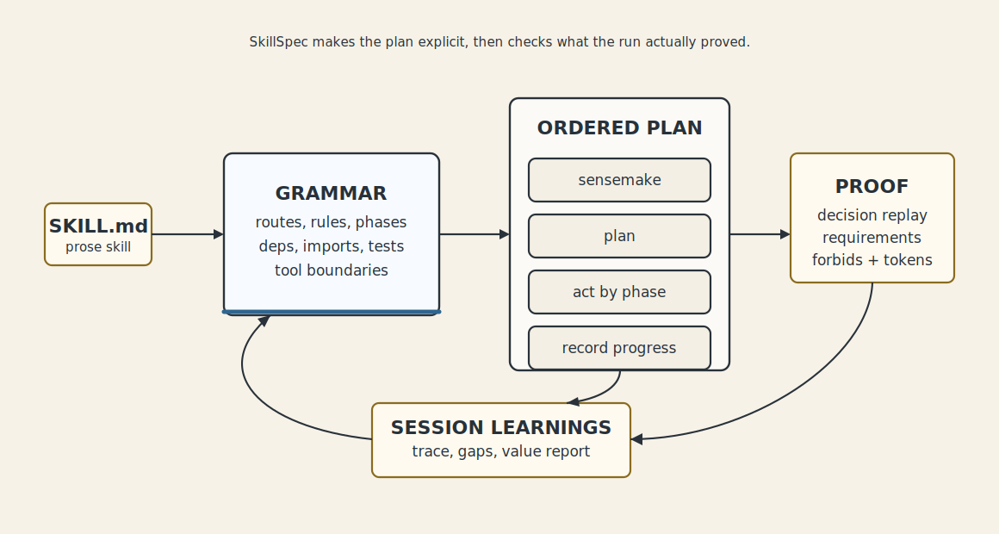

<p align="center">
  
</p>

# SkillSpec

[](https://github.com/modiqo/skillspec/actions/workflows/ci.yml)

Keep the prose. Structure the decisions.

SkillSpec turns long prose skills into compact, testable behavior contracts.
The prose still teaches tone and context. The `skill.spec.yml` carries the
parts agents should not guess: routes, rules, dependencies, code snippets,
imports, resources, recipes, elicitations, tests, and traces.

The claim is simple: keep `SKILL.md` tiny, move decisions into a spec, and make
agent steering something you can validate, trace, port, and improve.

Use it when you want a skill to be portable across Codex, Claude, Hermes, or
another harness without relying on paragraphs of instructions alone.

## Where SkillSpec Fits

- Agent Skills define what to load.
- MCP defines what tools and data are available.
- SkillSpec defines how the agent should decide, verify, and report behavior.

SkillSpec is not a replacement for prose, MCP, or harness policy. It is the
machine-checkable contract for the behavioral parts of a skill that should be
tested, traced, compiled, and reviewed.

The result should be a smaller, more durable skill: a tiny loader for the
harness, a structured contract for decisions, runtime imports for active
guidance, and original prose/resources preserved as source material.

## How It Works

<p align="center">
  
</p>

The loop is intentionally visible:

```text
import existing skill -> compile for harness -> install -> run -> prove value
```

Inside a harness run:

```text
run-loop --guide agent -> current gate -> progress -> resume -> align -> value report
```

The user sees concrete proof, not vague confidence:

```text
Decision replay: pass
Phase order: pass
Requirements: 4/5 proven
Missing proof: requirement `install_codex` has no progress event
Forbidden actions: no violations recorded
Alignment: partial
```

## Install The CLI

From this repository:

```sh
cargo install --path crates/skillspec-cli --force
```

During development you can also run the local binary directly:

```sh
cargo build
./target/debug/skillspec --help
```

Check the installed CLI has the expected surface:

```sh
skillspec --help
skillspec import-skill --help
skillspec grammar sensemake --help
skillspec grammar checklist --help
skillspec grammar schema --help
skillspec imports check --help
skillspec deps check --help
skillspec sensemake --help
skillspec run-loop --help
skillspec query --help
skillspec refs --help
skillspec capability --help
skillspec index --help
skillspec router index refresh --help
skillspec workspace --help
skillspec workspace map --help
skillspec workspace install --help
```

## SkillSpec Prompt Setup

After installing SkillSpec, use the `skillspec` prompt skill as the setup and
authoring multiplexer:

```text
/skillspec import <local-skill-folder-or-github-url>
/skillspec map <multi-skill-or-plugin-workspace>
/skillspec install router
/skillspec install durable-executor from <local-skill-folder-or-github-url>
/skillspec observe durable workspace <workspace> and create a spec skill
```

Examples:

```text
/skillspec import /Users/me/.agents/skills/durable-executor
/skillspec import https://github.com/anthropics/skills/tree/main/skills/pdf
/skillspec map /Users/me/tulving/claude-for-legal
```

The `skillspec` prompt skill does the careful path:

1. Stages remote sources locally with `skillspec source stage <uri> --json`,
   then uses the returned `selected_source_path` or selected
   `candidates[].source_path`.
2. Reads the skill folder, not just `SKILL.md`.
3. Runs the deterministic importer.
4. Promotes imports, resources, code snippets, artifacts, recipes,
   dependencies, rules, and tests into a reviewed `skill.spec.yml`.
5. Validates and tests the spec.
6. Optionally compiles and installs a generated harness skill.

For direct CLI use, stage a URI before importing:

```text
skillspec source stage https://github.com/anthropics/skills/tree/main/skills/pdf --out ./.skillspec/staged/pdf --json
skillspec source map ./.skillspec/staged/pdf/repo/skills/pdf --out ./draft/.skillspec/source-map
skillspec import-skill ./.skillspec/staged/pdf/repo/skills/pdf --out ./draft/skill.spec.yml --source-map ./draft/.skillspec/source-map/source-map.json
```

Router install stays in the selected roots. It applies explicit-only native
controls across managed roots, writes the routing index, and runs a status check
so the prepared router is present and non-stale before use. Shared `.agents`
roots receive both Codex and Claude visibility controls. durable-executor is
optional: when present it remains the implicit first hop for router mode; when
missing, SkillSpec reports that durable first-hop is unavailable unless the user
supplies an approved source. When a skill is added outside `skillspec install
skill`, `skillspec router index status` detects prose-only versus
SkillSpec-backed additions and `skillspec router index refresh` reapplies
explicit invocation controls before rebuilding the index.

Use the lower-level `skillspec index` command only when you intentionally want
to build the router SQLite catalog for `skillspec route` or the optional
skill-router. It is not a repository search command, source map, workspace map,
or import planner. Direct execution prints router-state warnings: without router
config it is standalone manual lookup only; with disabled router mode it will
not affect implicit skill selection until `skillspec router enable` runs; with
enabled router mode, `skillspec router index refresh` is usually the better
maintenance command because it also reapplies visibility and checks
preparedness.

Before importing, classify the source shape:

| Source shape | Command path |
| --- | --- |
| Exactly one `SKILL.md` and package-local resources | `skillspec port-one-shot` |
| Multiple `SKILL.md` files or cross-skill file references | `skillspec workspace map`, then validate/import/converge/compile |
| Plugin-shaped root with `skills/` plus `.claude-plugin/plugin.json`, `.mcp.json`, or `CLAUDE.md` | workspace flow with plugin namespace preservation |
| Existing reviewed `skill.spec.yml` | revise the spec from grammar/current-spec handles; do not re-import |

Use `skillspec doctor <target>` as the cheap shape gate when the source could
be a repo URI or parent folder. The default output is a formatted user report;
use `--html` for a self-contained review page and `--json` when a caller needs
the full machine report. It reports `simple_skill`,
`entry_skill_with_subskills`, `multi_skill_workspace`, `plugin_workspace`, or
`non_skill_repository`. `simple_skill` gets full source-map structural scoring
plus frontmatter discovery and agent drift risk. Multi-skill,
entry-with-subskills, and plugin-shaped roots get `analysis_status: workspace`,
an aggregate workspace risk block, and one package report per `SKILL.md` while
preserving plugin namespaces. Ordinary code repos still stop with
`analysis_status: shape_only` and a recommended next command.

Inside the installed `/skillspec` skill, plain prompts such as "what is the
shape of this skill", "shape of skill", and "run doctor on this repo/url" route
to this doctor-only inspection path. They do not import, port, compile, install,
or choose a remote candidate.

For one atomic skill package, prefer the bundled porting path:

```sh
skillspec port-one-shot path/to/skill-folder \
  --out path/to/skill-folder \
  --target codex-skill \
  --prove
```

It writes grammar/schema/checklist proof, a source map, doctor report, typed
mechanical draft, shape crib, QA results, compiled loader, and compact report
under `.skillspec/`. When a trace run is supplied with `--run-dir`, it also
records estimated direct-run token metrics so alignment does not report token
usage as missing.

The command does not auto-fill behavior. After the scaffold, the agent should
make one guided promotion pass: choose source-backed activation/routes, promote
only evidenced rules/dependencies/recipes/tests, fill coverage rows for open
gaps, run the QA ladder once, then fix failures by class instead of one field at
a time. Quote YAML strings that contain `: `, especially elicitation questions,
descriptions, `steps[].note`, recipe/procedure notes, and review notes. Keep
artifact `produced_by` / `consumed_by` refs limited to `command`,
`code`, or `recipe`.

The lower-level mechanical importer is still available when you only want a
draft or need to debug one gate:

```sh
skillspec grammar sensemake --view index
skillspec grammar sensemake --view porting
skillspec source map path/to/skill-folder --out path/to/skill-folder/.skillspec/source-map
skillspec import-skill path/to/skill-folder \
  --out skill.spec.yml \
  --source-map path/to/skill-folder/.skillspec/source-map/source-map.json
skillspec sensemake skill.spec.yml --view index
skillspec grammar checklist --for import-skill
skillspec validate skill.spec.yml
skillspec imports check skill.spec.yml
skillspec deps check skill.spec.yml
skillspec test skill.spec.yml
skillspec plan skill.spec.yml --input '<realistic task>' --trace-dir .skillspec/traces
skillspec act skill.spec.yml \
  --input '<realistic task>' \
  --run .skillspec/traces/<run-id> \
  --phase <phase-id>
skillspec progress show skill.spec.yml --run .skillspec/traces/<run-id>
skillspec trace align skill.spec.yml \
  --decision-trace .skillspec/traces/<run-id> \
  --execution-trace .skillspec/traces/<run-id>/execution.jsonl \
  --summary \
  --proof-digest .skillspec/traces/<run-id>/proof-digest.json
```

`import-skill` preserves source material; it does not pretend to understand the
whole skill. It extracts runtime-loadable Markdown imports, source resources,
fenced code blocks, shell-like commands, obvious dependencies, headings, and
strong directive language, then marks uncertainty as `review_required`.

`grammar sensemake` is embedded in the binary so an agent can learn the grammar
without reading repository source. Use `--view index` for the section map,
`--view summary` for prose-to-construct mappings, and `--view porting` for the
full import command sequence plus the coverage matrix. `grammar checklist --for
import-skill` is the review gate: every prose obligation should map to a
SkillSpec construct with confidence, status, and review notes before install.

## Map A Multi-Skill Or Plugin Workspace

When a source root contains many `SKILL.md` files, cross-skill references, or
plugin markers, do not import the parent folder as one skill. Map the workspace
first:

```sh
skillspec workspace map ./skills --out ./build/skillspec.workspace.yml --summary
skillspec workspace validate ./build/skillspec.workspace.yml --summary
skillspec workspace import ./build/skillspec.workspace.yml --out ./workspace-build --summary
skillspec workspace converge ./build/skillspec.workspace.yml --build-root ./workspace-build --summary
skillspec workspace compile ./build/skillspec.workspace.yml --build-root ./workspace-build --target codex-skill --summary
skillspec workspace install ./build/skillspec.workspace.yml --build-root ./workspace-build --target codex --dry-run --summary
skillspec workspace install ./build/skillspec.workspace.yml --build-root ./workspace-build --target codex --apply-visibility --summary
```

This is authoring recon, not router indexing. `workspace map` creates a
`skillspec.workspace.yml` manifest with one package per atomic `SKILL.md`,
deterministic install slugs, references, and dependency edges. `workspace
import` fans out one draft package per skill under a mirrored build root.
Dependency-ready packages can import in parallel, and unchanged packages are
reused from `<build-root>/.skillspec/workspace-cache.json` when source hashes and
proof artifacts still match.
`workspace converge` verifies those drafts before compile. `workspace compile`
writes harness-ready loaders. `workspace install` preflights every write,
blocks collisions, and can apply the workspace visibility policy.

Use `--summary` for harness-friendly output with wall-clock and estimated token
metrics, including cache hits and misses where applicable. The detailed reports,
source maps, package evidence, loaders, and install manifests remain on disk at
the printed paths. Use `--json` when a machine caller needs the full report on
stdout.

Direct-run summaries estimate output economy from the compact agent-visible
response versus artifacts preserved on disk. Durable-executor runs can
additionally report measured workspace token consumption. To make direct-run
summary numbers appear in `trace align --summary`, record the printed summary block before
alignment:

```bash
skillspec progress stats .skillspec/traces/<run-id> \
  --agent-visible-tokens 190 \
  --artifact-tokens-preserved 96190 \
  --avoided-tokens 96000 \
  --metrics-source estimated
```

Plugin-shaped repositories keep their plugin boundaries. A folder with `skills/`
plus `.claude-plugin/plugin.json`, `.mcp.json`, or `CLAUDE.md` becomes a plugin
namespace. Repeated names are made skill-safe by prefixing the plugin name, so
`commercial-legal/skills/cold-start-interview` becomes
`commercial-legal-cold-start-interview`. Inside that plugin,
`/cold-start-interview` resolves locally; `/privacy-legal:use-case-triage`
resolves across plugins. Those slash-command references are workflow links, not
hard dependency edges. Relative file references remain hard dependencies.

## Install A SkillSpec-Backed Skill

For installing SkillSpec itself into a harness, prefer the official plugin
marketplace flow:

```sh
cargo install skillspec
skillspec --version

# unreleased main
cargo install --git https://github.com/modiqo/skillspec --package skillspec --force

claude plugin marketplace add modiqo/skillspec --sparse .claude-plugin plugins/skillspec
claude plugin install skillspec@skillspec
claude plugin list

codex plugin marketplace add modiqo/skillspec --ref main --sparse .agents --sparse plugins/skillspec
codex plugin add skillspec@skillspec
```

Use direct `skillspec install skill` only for generated skills, local
development checkouts, or unreleased package testing. Codex plugin install does
not have a separate plugin enable step. Claude installs the plugin enabled by
default in current Claude Code builds; if `claude plugin list` shows it
disabled, run `claude plugin enable skillspec`.

A generated skill folder should look like this:

```text
my-skill/
  SKILL.md          # minimal harness-facing loader
  skill.spec.yml    # structured behavior contract and source of truth
  source/           # optional preserved source skill/resources
```

Detect available harness skill roots:

```sh
skillspec install targets
```

Preview an install:

```sh
skillspec install skill my-skill --target agents --target codex --dry-run
```

Install into one or more harnesses:

```sh
skillspec install skill my-skill --target agents
skillspec install skill my-skill --target agents --target codex
skillspec install skill my-skill --all-detected
```

The `skillspec` skill can prepare this folder after validation. Do not install a
generated skill until:

```sh
skillspec validate my-skill/skill.spec.yml
skillspec imports check my-skill/skill.spec.yml
skillspec test my-skill/skill.spec.yml
skillspec deps check my-skill/skill.spec.yml
```

If `deps check` reports confirmed missing local dependencies, leave the skill
draft-only or add explicit provision choices. Package, service, adapter, and
browser checks may be reported as `deferred`; those remain visible and must be
verified by the harness or runtime path before use. SkillSpec should not
silently install global dependencies.

Current install targets:

- `agents`: `~/.agents/skills/<skill-name>`
- `codex`: `~/.codex/skills/<skill-name>`
- `claude-local`: nearest `.claude/skills/<skill-name>` in the current repo

## Seed A Local Capability

When a CLI, adapter, or script exists before a reviewed domain SkillSpec exists,
record it as a local capability seed. Seeds live under:

```text
~/.skillspec/capabilities/<domain>/<seed-id>.yml
```

Example for a voice/text-to-speech CLI:

```sh
skillspec capability add preferred-voice-cli \
  --domain voice \
  --kind cli \
  --command voice-cli \
  --provides text_to_speech \
  --provides voice_generation \
  --alias "voice message" \
  --priority 80 \
  --preferred-for text_to_speech \
  --tie quality=high \
  --auth-env VOICE_PROVIDER_API_KEY \
  --external-service \
  --may-cost-money \
  --evidence-command "voice-cli --help" \
  --suggested-skill-id voice.provider

skillspec capability verify preferred-voice-cli --domain voice --json
skillspec capability search text_to_speech --domain voice --explain --json
```

Use `update` for patch-style changes that preserve unspecified fields:

```sh
skillspec capability update preferred-voice-cli \
  --domain voice \
  --add-provides speech_synthesis \
  --add-alias "read aloud" \
  --add-preferred-for speech_synthesis
```

`search` returns ranked candidates with scores, reasons, risk flags, and
required gates. If the top candidates are close, `selected` is `null` and the
agent should ask the user rather than auto-picking. Use `prefer` to adjust local
ranking without editing durable-executor:

```sh
skillspec capability prefer preferred-voice-cli \
  --domain voice \
  --for text_to_speech \
  --priority 90
```

If a seed stops working for a capability, mark it failed and de-prioritize that
capability without deleting the seed:

```sh
skillspec capability update preferred-voice-cli \
  --domain voice \
  --remove-preferred-for text_to_speech \
  --add-avoid-for text_to_speech \
  --priority 0 \
  --mark-failed
```

durable-executor uses these seeds only as a bootstrap path when no domain
SkillSpec owns the capability yet. A successful traced run can draft a reviewed
domain SkillSpec; seeds are not a replacement for domain skills.

If the first seed search is empty, the agent should search related normalized
capabilities and domains before using any unseeded local fallback. For example,
a voice request may need searches for `voice`, `text_to_speech`,
`voice_generation`, `speech_synthesis`, `audio_generation`, and
`voice_message`. If no seed is found, the agent should ask before using the
fallback or create and verify a seed for it first.

## Use A SkillSpec-Backed Skill

In a harness session, invoke the generated skill normally:

```text
/my-skill do the task
```

The generated `SKILL.md` should tell the agent to use the sibling
`skill.spec.yml`. The preferred runtime loop is guide-first:

```sh
skillspec run-loop path/to/skill.spec.yml \
  --input='the user task text' \
  --trace-dir .skillspec/traces \
  --guide agent
skillspec run-loop path/to/skill.spec.yml \
  --resume .skillspec/traces/<run-id> \
  --guide agent
```

The guide prints the selected route, current gate, allowed commands, proof end
anchor, and resume command. The underlying primitives remain available for
explicit checks and debugging:

```sh
skillspec sensemake path/to/skill.spec.yml --view index
skillspec validate path/to/skill.spec.yml
skillspec imports check path/to/skill.spec.yml
skillspec deps check path/to/skill.spec.yml
skillspec plan path/to/skill.spec.yml \
  --input='the user task text' \
  --trace-dir .skillspec/traces
skillspec act path/to/skill.spec.yml \
  --input='the user task text' \
  --run .skillspec/traces/<run-id> \
  --phase <phase-id>
skillspec progress record .skillspec/traces/<run-id> phase-started \
  <phase-id> \
  --evidence-kind checklist \
  --evidence-ref skillspec-act
skillspec progress record .skillspec/traces/<run-id> requirement-satisfied \
  <phase-id> <requirement-id> \
  --evidence-kind <kind> \
  --evidence-ref <ref>
skillspec progress record .skillspec/traces/<run-id> phase-completed \
  <phase-id> \
  --evidence-kind <kind> \
  --evidence-ref <ref>
skillspec progress stats .skillspec/traces/<run-id> \
  --workspace <workspace> \
  --workspace-stats-report .skillspec/traces/<run-id>/workspace-stats.txt \
  --phase durable_closure \
  --requirement compute_workspace_stats \
  --requirement record_stats_collected_event
skillspec progress stats .skillspec/traces/<run-id> \
  --agent-visible-tokens <n> \
  --artifact-tokens-preserved <n> \
  --avoided-tokens <n> \
  --metrics-source estimated \
  --phase <phase-id> \
  --requirement <stats-requirement-id>
skillspec progress final-response .skillspec/traces/<run-id> \
  --phase durable_closure \
  --requirement record_final_response_sent_event \
  --requirement report_workspace_evidence_and_token_math \
  --result --evidence --alignment --token-savings
skillspec progress batch .skillspec/traces/<run-id> \
  --events .skillspec/traces/<run-id>/final-proof.jsonl
skillspec progress show path/to/skill.spec.yml \
  --run .skillspec/traces/<run-id>
```

`run-loop --guide agent` is the preferred trampoline entry point. It loads the
spec once, selects the route, opens or resumes a trace run, prints start/current
/end anchors, writes `<run-dir>/guide-state.json` and
`<run-dir>/guide-summary.md`, and tells the agent which command or query to use
next.

`sensemake` is the progressive orientation step. Index view returns the
SkillSpec map, section roles, counts, and navigation commands without dumping
all handles. Use `--view full` only when exact route/rule/command/test handles
are needed.

For `/skillspec create from observed durable execution: "..."`, the prompt
multiplexer collects durable workspace evidence and then calls the synthesis CLI
only after the observed result and evidence summary have been shown and
approved:

```sh
skillspec synthesize-from-workspace <workspace> \
  --task '<observed task>' \
  --out <skill-folder> \
  --observation-approved
```

If live workspace lookup is unreliable, capture `rote workspace stats`, `rote
workspace inspect log`, and `rote workspace inspect meta` from inside the
workspace and pass them with `--workspace-stats-report`, `--workspace-log`, and
`--workspace-meta`.

`plan` fits the actual task to a selected route, writes the decision trace, and
prints the ordered phase names before any substrate tool is used. Reuse the
`run_dir` printed by `plan` for the rest of the loop. `act` expands the current
phase into an OODA checklist: route authority, matched rules, allowed actions, forbids,
handoff boundaries, dependencies, evidence expectations, and before-tool-call
checks. After each phase action, `progress record` appends structured execution
evidence to `.skillspec/traces/<run-id>/execution.jsonl`, and `progress show`
derives `.skillspec/traces/<run-id>/progress.json` with completed, current,
blocked, and remaining phases.

For durable-executor runs, persist the workspace stats to a report file and run
`progress stats` before `trace align --summary`. That appends the `stats_collected` event
the aligner uses for measured token consumption and query-reduction savings,
without manually editing `execution.jsonl`. After
drafting the final report sections, run `progress final-response --result
--evidence --alignment --token-savings` with the durable closure phase and
requirements, then rerun `trace align --summary` so the final alignment proves the
response included evidence, alignment, and token usage.

At final proof time, use a two-align loop: run one initial
`trace align --summary --proof-digest <run-dir>/proof-digest.json`, build
`<run-dir>/final-proof.jsonl` from that digest and real evidence, run
`skillspec progress batch` once, then run one final `trace align --summary`.
Do not rerun alignment after each individual proof row. When final closure needs
several route, route-check, elicitation, forbid/no-violation, or after-success
proof rows, this keeps `execution.jsonl` exact without making the user watch a
parade of bookkeeping commands.

The agent remains the executor. SkillSpec supplies the contract and the phase
tracker so the harness can ask "what is the current phase?" and "what remains?"
without rereading the whole YAML.

During the loop, pull only the active slices and relationships you need:

```sh
skillspec query path/to/skill.spec.yml rule:<matched-rule> --view summary
skillspec refs path/to/skill.spec.yml rule:<matched-rule> --view summary
skillspec query path/to/skill.spec.yml rule:<matched-rule>.forbid --json
skillspec query path/to/skill.spec.yml command:<command-id>.requires
skillspec query path/to/skill.spec.yml state:<state-id>.next --json
skillspec query path/to/skill.spec.yml test:<test-name>.expect --view full
skillspec refs path/to/skill.spec.yml test:<test-name> --view summary
```

Quote the handle when a test name contains spaces.

Query detail is progressive:

- `--view index`: ids and handles only
- `--view summary`: compact resolved relationships for decisions
- `--view full`: the full typed YAML-derived object

For debugging:

```sh
skillspec explain path/to/skill.spec.yml \
  --input='the user task text' \
  --trace-dir .skillspec/traces

skillspec trace compact .skillspec/traces/<run-id>

skillspec trace align path/to/skill.spec.yml \
  --decision-trace .skillspec/traces/<run-id> \
  --execution-trace .skillspec/traces/<run-id>/execution.jsonl \
  --summary \
  --proof-digest .skillspec/traces/<run-id>/proof-digest.json
```

`trace align --summary` replays the captured input against the current spec and
compares the decision facts deterministically. With `execution.jsonl`, it can
also check whether the selected route, phase obligations, forbids, and
after-success closures were actually proven. Without structured execution
evidence it reports the specific missing proof rows as `unproven`, not as
guessed pass/fail results.
It writes the full alignment report to
`.skillspec/traces/<run-id>/alignment.json` so the completion summary and token
usage are durable run artifacts.
Use `--summary` for normal harness runs; it prints only the completion-facing
block plus the alignment report path. Add `--proof-digest` during completion
audits to write grouped missing-proof rows for one `progress batch` command
instead of a repeated align-record-align loop. Omit `--summary` only for
debugging, failure triage, or explicit user requests for detailed checks. The
summary block is:

```text
alignment_summary:
  Decision replay: pass
  Phase order: pass
  Requirements: 4/5 proven
  Missing proof: requirement `install_codex` has no progress event
  Forbidden actions: no violations recorded
  Alignment: partial
token_usage:
  Token consumption: total 1234 tokens
  Token savings: 3729702 tokens saved by query reduction (4439892 cached response tokens reduced to 710190 query-result tokens, 84.0% reduction)
alignment_report: .skillspec/traces/<run-id>/alignment.json
proof_digest: .skillspec/traces/<run-id>/proof-digest.json
```

When token stats are absent, `Token consumption` and `Token savings` are shown
as `not recorded` rather than omitted. When query-reduction stats are present,
`Token consumption` describes the extracted query-result data actually recorded,
and `Token savings` names the cached-response token count, extracted
query-result token count, saved-token delta, and reduction percentage.
Direct CLI `--summary` metrics are separate estimated output-economy numbers. Use
`progress stats --agent-visible-tokens ... --artifact-tokens-preserved ...
--avoided-tokens ... --metrics-source estimated` to record them for alignment,
and do not describe them as measured model token consumption.
Once recorded, `trace align --summary` prints them in `token_usage` as estimated
agent-visible output and estimated tokens kept out of chat.

Compiled SkillSpec-backed `SKILL.md` loaders include runtime guidance for using
an existing `skill.spec.yml`: validate first, check dependencies, create the
phase plan, act on the current phase, obey forbids and elicitations, record
progress evidence, then report trace and alignment.

`skillspec act` also renders `PHASE TOOL BOUNDARY - HARD` for every phase. The
effective boundary inherits `entry.tool_boundary`, route `tool_boundary`, and
phase `tool_boundary`; if none is declared, SkillSpec renders a conservative
default-deny boundary. Any tool, data source, execution substrate, provider,
adapter, CLI, browser mode, API, or skill outside that boundary requires
explicit user permission before use.

## Compile A SkillSpec Into Harness Guidance

Render a `skill.spec.yml` into a harness-facing `SKILL.md`:

```sh
skillspec compile skill.spec.yml --target codex-skill > SKILL.md
skillspec compile skill.spec.yml --target claude-skill > SKILL.md
skillspec compile skill.spec.yml --target markdown > skill.spec.md
```

For harness skill targets, compilation emits a minimal loader by default. The
loader points the agent at the colocated `skill.spec.yml`, tells it to run
`skillspec plan ... --trace-dir`, `skillspec act ...`, preserve the emitted
`run_dir`, record phase progress, and follow the spec. This keeps `SKILL.md`
small and prevents it from becoming a second source of truth.

Use the Markdown target when you want a full human-readable rendering of the
contract. `--target markdown` includes routes, rules, dependencies, imports,
resources, code, artifacts, recipes, commands, snippets, closures, scenario
tests, proof metrics, review notes, and CLI commands for validation and
explanation.

## What Goes In A Spec

A `skill.spec.yml` can describe:

- intent routing
- route order
- forbidden substitutions
- bounded user questions and choices
- state transitions
- declared dependencies and provision choices
- runtime-loadable imports for shared policy, references, procedures, examples,
  and skill docs
- source resources from imported multi-file skills
- code snippets with provenance, dependencies, inputs, outputs, and safety
- named artifacts consumed or produced by code and commands
- ordered recipes for procedural skills
- command templates
- completion closures
- scenario tests
- decision traces
- proof metrics

Example shape:

```yaml
schema: skillspec/v0
id: rote.computer
title: rote computer
description: Route task-first work across remembered routes, services, CLIs, and browsers.

rules:
  - id: browse_means_browser
    when:
      user_says_any: ["browse", "open", "click", "snapshot", "extract from page"]
    prefer: browser
    forbid: ["native_search_as_answer", "raw_playwright", "curl"]

tests:
  - name: browse calendar routes to browser
    input: "browse my calendar"
    expect:
      route: browser
      forbid: ["native_search_as_answer", "adapter_setup_first"]
```

## Repository Layout

```text
spec/       specification, schema, semantics, security notes
examples/   complete SkillSpec examples
conformance/ valid and invalid fixtures for CLI conformance behavior
skills/     official SkillSpec-backed skills for authoring specs
.claude/    repo-local SkillSpec-backed skills for this repository
crates/     reference Rust CLI
fixtures/   sample skills and expected outputs
```

Useful examples:

- [examples/rote-computer/skill.spec.yml](../examples/rote-computer/skill.spec.yml)
- [examples/durable-executor/skill.spec.yml](../examples/durable-executor/skill.spec.yml)
- [examples/generic-skill-creator/skill.spec.yml](../examples/generic-skill-creator/skill.spec.yml)
- [examples/local-csv-report/skill.spec.yml](../examples/local-csv-report/skill.spec.yml)
- [examples/pdf-processing/skill.spec.yml](../examples/pdf-processing/skill.spec.yml)
- [examples/before-after/](../examples/before-after/) shows a prose skill before
  and after a SkillSpec-backed port.

Installable examples are folder-shaped and include a generated `SKILL.md`
trampoline plus `skill.spec.yml`:

```sh
skillspec install skill examples/durable-executor --target agents --target codex --dry-run
```

## Verification Suite

Run the Rust unit and CLI integration suite:

```sh
cargo test --workspace --all-targets
```

Run the repository-level conformance sweep:

```sh
cargo build
find examples -name '*.yml' -exec target/debug/skillspec validate {} \;
find examples -name '*.yml' -exec target/debug/skillspec imports check {} \;
find examples -name '*.yml' -exec target/debug/skillspec test {} \;
find examples -name '*.yml' -exec target/debug/skillspec deps check {} \;
```

The test suite covers strict typo rejection across typed grammar nodes,
scenario-test pass/fail behavior, required trace enforcement and compaction,
dependency status semantics and command scoping, compiler targets, importer
draft generation, install target behavior, full JSON Schema validation against
examples, conformance fixtures, and golden snapshots for compiler/importer
output.

CI runs a full Ubuntu quality gate, verifies the crates.io package with
`cargo publish --locked --dry-run -p skillspec`, and runs native locked
build/test jobs on Linux, macOS, and Windows.

Tagged releases build native CLI archives for Linux, macOS, and Windows with
SHA-256 checksums and publish the `skillspec` crate to crates.io when the
`CARGO_REGISTRY_TOKEN` repository secret is configured.

The minimum compliance gate for a SkillSpec-backed skill is:

```sh
skillspec validate skill.spec.yml
skillspec imports check skill.spec.yml
skillspec test skill.spec.yml
skillspec deps check skill.spec.yml
```

## Community And RFC

- [docs/03-rfc-v0.md](03-rfc-v0.md) is the RFC-style announcement draft.
- [docs/01-why-skillspec.md](01-why-skillspec.md) explains why structured
  behavior contracts help.
- [docs/why-skillspec-demo/](why-skillspec-demo/) contains a demo-ready prose versus
  SkillSpec comparison.
- [docs/02-prose-vs-skillspec.md](02-prose-vs-skillspec.md) compares prose-only
  skills with SkillSpec-backed skills.
- [docs/04-community-outreach.md](04-community-outreach.md) names the launch
  audiences and the specific ask.
- [DISCUSSIONS.md](../DISCUSSIONS.md) defines recommended GitHub Discussions
  categories.
- [CONTRIBUTING.md](../CONTRIBUTING.md) describes local development, spec changes,
  and golden snapshot updates.
- [docs/05-good-first-issues.md](05-good-first-issues.md) lists starter issues
  for contributors.
- [docs/06-community-posts.md](06-community-posts.md) contains short launch post
  drafts.

Repo-local skills live in `.claude/skills/<name>/` and are checked in despite
common global ignores for `.claude*`. Each one keeps:

```text
.claude/skills/<name>/
  SKILL.md          # minimal loader generated by skillspec compile
  skill.spec.yml    # reviewed structured contract
  source/SKILL.md   # original prose skill retained as provenance
```

## Formal Model

SkillSpec v0 has a formal grammar and relationship model:

- [spec/grammar.md](../spec/grammar.md) defines the v0 tree.
- [spec/relationships.md](../spec/relationships.md) explains how concepts
  associate.
- [spec/rules.md](../spec/rules.md) defines rule evaluation and negative
  steering.
- [spec/trace.md](../spec/trace.md) defines append-only decision traces.
- [spec/imports.md](../spec/imports.md) defines import resolution, sections, and
  nesting.
- [spec/skill.spec.schema.json](../spec/skill.spec.schema.json) is the strict JSON
  schema for typed v0 fields.

The core association is:

```text
rules steer routes, elicitations, and closures
states organize lifecycle
elicitations ask bounded questions
dependencies declare required tools and provision choices
imports load active guidance deliberately
resources preserve source provenance
code preserves executable knowledge
artifacts name consumed and produced data
recipes bind ordered procedures
commands perform named actions
tests prove steering behavior
trace records runtime causality
proof summarizes accuracy, context escape, and replay savings
```

## Status

Pre-alpha. The CLI and spec are useful for dogfooding now, but the format is
still moving. The current focus is proving that existing prose skills can be
ported into structured, testable, cross-harness behavior without losing their
source material.

See [roadmap.md](../roadmap.md) for what is distinctive today and where the project
is not yet outstanding.
