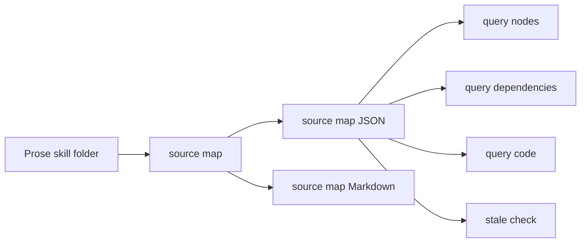
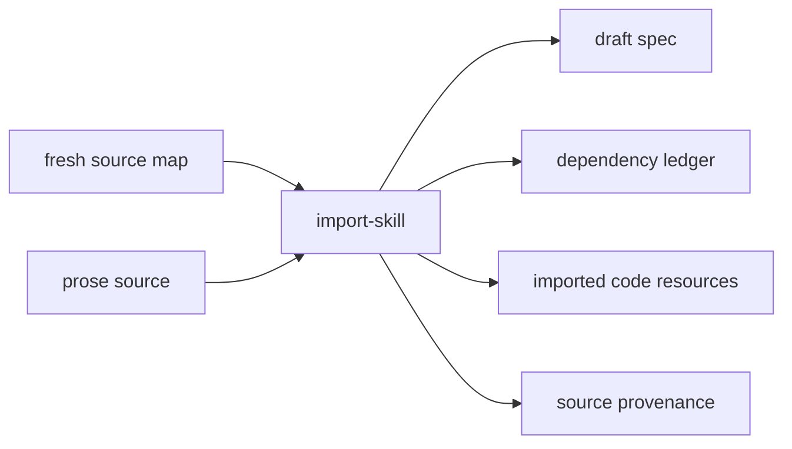
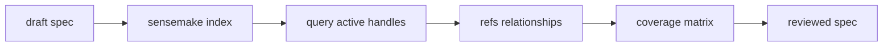
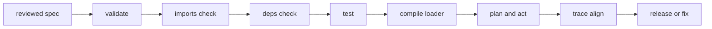

# Import To Release

This explainer shows how SkillSpec turns a prose skill into a releasable
SkillSpec-backed skill without forcing the agent to load the whole source or the
whole generated spec at once.

The important shape is:

```text
map first -> scaffold mechanically -> author progressively -> prove before release
```

## Context Burden Reduced

This workflow removes three common sources of prompt load:

- full source documents are replaced by source-map handles;
- full draft YAML is replaced by `sensemake`, `query`, and `refs`;
- full execution proof is replaced by traces, progress events, and alignment
  reports.

## 1. Map Before Import

The source map is the first context-reduction layer. It lets the agent inspect a
large `SKILL.md` package by handles, exact spans, dependency signals, and code
blocks before import.



Grounded commands:

```sh
skillspec source map <source-skill> --out <draft>/.skillspec/source-map
skillspec source coverage <draft>/.skillspec/source-map/source-map.json
skillspec source query <draft>/.skillspec/source-map/source-map.json nodes --view index
skillspec source query <draft>/.skillspec/source-map/source-map.json dependencies --view summary
skillspec source query <draft>/.skillspec/source-map/source-map.json code --view summary
skillspec source stale <draft>/.skillspec/source-map/source-map.json --root <source-skill>
```

Review check:

- The agent can name the source files, headings, code blocks, dependencies, and
  review-required spans before running import.
- The map is fresh; stale maps block import.
- The agent reads exact spans only when the map says they are relevant.

## 2. Scaffold, Do Not Finish

`import-skill` creates a mechanical draft. It preserves material and identifies
review work; it does not claim the behavioral contract is complete.



Grounded command:

```sh
skillspec import-skill <source-skill> \
  --out <draft>/skill.spec.yml \
  --source-map <draft>/.skillspec/source-map/source-map.json
```

Review check:

- The draft is treated as scaffolding.
- `deps.toml` exists even when `dependency_count = 0`.
- Fenced source code is split into package-local resource files when needed.
- Dependency mentions are preserved, not removed to make QA pass.
- Empty routes, tests, states, or proof sections are review prompts, not defects
  to hide.

## 3. Progressive Authoring After Import

After import, the author reads the generated SkillSpec progressively. The agent
does not dump the full YAML into context. It uses section handles and exact refs
to promote only the active parts.



Grounded commands:

```sh
skillspec sensemake <draft>/skill.spec.yml --view index
skillspec query <draft>/skill.spec.yml <handle> --view summary
skillspec refs <draft>/skill.spec.yml <handle> --view summary
skillspec grammar checklist --for import-skill
```

Authoring targets:

- activation and `applies_when`
- routes and rules
- forbids, elicitations, and after-success closures
- dependencies and dependency review
- imports, resources, code, commands, recipes, and artifacts
- states and execution plans
- tests, trace requirements, and proof obligations

Review check:

- Every important prose obligation maps to a structured construct or a deliberate
  `review_required` note.
- Ambiguity is marked as review work, not silently converted to policy.
- Commands and recipes are declared surfaces, not permission to execute unknown
  tools.

## 4. Validate, Test, Compile, Release

Release is gated by structural checks, scenario tests, dependency review,
runtime planning proof, and alignment evidence.



Grounded commands:

```sh
skillspec validate <skill-folder>/skill.spec.yml
skillspec imports check <skill-folder>/skill.spec.yml
skillspec deps check <skill-folder>/skill.spec.yml
skillspec test <skill-folder>/skill.spec.yml
skillspec compile <skill-folder>/skill.spec.yml --target codex-skill
skillspec plan <skill-folder>/skill.spec.yml --input '<task>' --trace-dir <skill-folder>/.skillspec/traces
skillspec act <skill-folder>/skill.spec.yml --input '<task>' --run <run-dir> --phase <phase-id>
skillspec trace align <skill-folder>/skill.spec.yml --decision-trace <run-dir>
```

Release check:

- No install happens before dependency surface approval.
- Scenario tests pass.
- The compiled loader points back to `skill.spec.yml`.
- The proof report names missing evidence instead of claiming unproven success.

## What This Workflow Does Not Do

- It does not turn prose into a trusted contract automatically.
- It does not execute imported snippets during staging.
- It does not install missing packages without approval.
- It does not claim a full proof when dependencies, tests, or execution evidence
  are partial.

## Mental Model

Import reduces the cost of starting. Progressive reading reduces the cost of
authoring. The QA gates reduce the cost of trusting the result.
