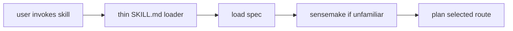
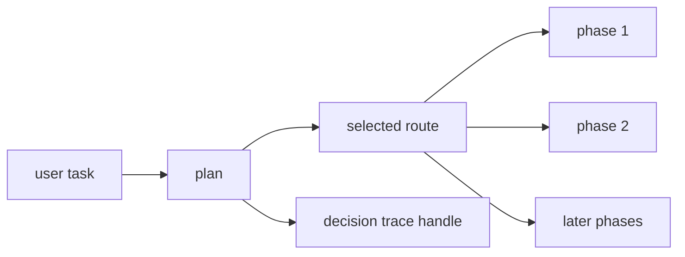
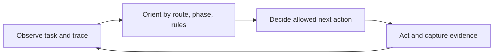
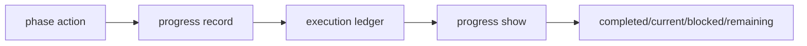
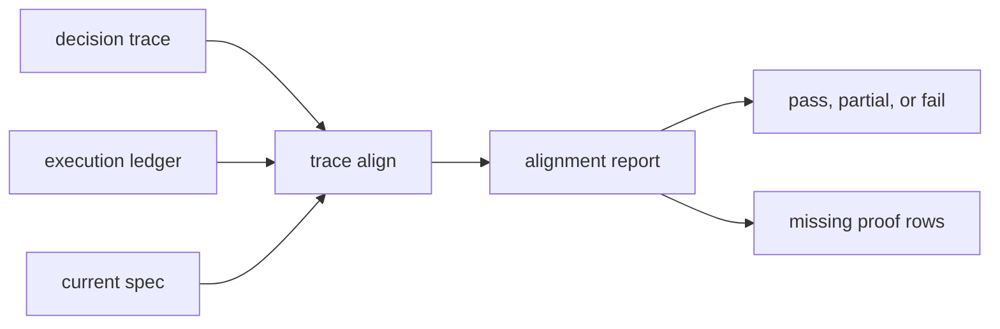

# Runtime Trampoline And Alignment

This explainer shows what happens after a SkillSpec-backed skill is installed.
The visible `SKILL.md` is a trampoline: it loads the colocated
`skill.spec.yml`, then keeps the agent inside a stepwise runtime loop.

## Context Burden Reduced

The runtime loop keeps the prompt small by replacing broad instruction loading
with progressive handles:

- the loader points to the spec instead of duplicating behavior;
- `plan` exposes only the selected route's phase order;
- `act` exposes only the current phase checklist;
- `progress` and `align` preserve evidence outside the prompt.

## 1. Thin Loader To Contract

The loader is intentionally small. It is not a second source of truth.



Review check:

- The loader tells the agent to load `skill.spec.yml`.
- Behavior lives in the spec, not in duplicated loader prose.
- The agent strips invocation prefixes before routing task input.

## 2. Plan Before Action

`plan` turns a task into ordered phases. It prevents the agent from jumping
straight to convenient tools or late-stage proof.



Grounded command:

```sh
skillspec plan ./skill.spec.yml \
  --input '<task>' \
  --trace-dir .skillspec/traces
```

Review check:

- The printed `run_dir` is preserved.
- The selected route is named.
- The phase order is followed before tool use.

## 3. Act As OODA Loop

`act` expands the current phase into an operating checklist. This is the OODA
loop the agent follows before each tool call.



The checklist answers:

- What route owns this run?
- What phase is current?
- What tools, data sources, substrates, providers, APIs, CLIs, browser modes, or
  skills are allowed now?
- What is forbidden?
- What dependency or approval gate applies before action?

Grounded command:

```sh
skillspec act ./skill.spec.yml \
  --input '<task>' \
  --run .skillspec/traces/<run-id> \
  --phase <phase-id>
```

Review check:

- Unlisted tools require explicit permission.
- Active forbids block substitutions.
- Handoffs are treated as execution boundaries.

## 4. Progress Becomes Evidence

The agent records what happened after each phase or requirement. The progress
ledger keeps proof outside the prompt while still making it addressable.



Grounded commands:

```sh
skillspec progress record <run-dir> requirement-satisfied <phase-id> <requirement-id> \
  --evidence-kind command \
  --evidence-ref <ref>

skillspec progress show ./skill.spec.yml --run <run-dir>
```

Review check:

- Evidence has a kind and a reference.
- Missing proof stays missing.
- Progress is derived from structured events, not chat memory.

## 5. Alignment Closes The Loop

Alignment compares the decision trace and execution ledger against the current
spec.



Grounded command:

```sh
skillspec trace align ./skill.spec.yml \
  --decision-trace <run-dir> \
  --execution-trace <run-dir>/execution.jsonl
```

Review check:

- Final answers report result, evidence, alignment, token usage, and trace path.
- Partial proof is reported as partial.
- Token savings are measured or explicitly marked not recorded.

## What This Workflow Does Not Do

- It does not execute task work by itself.
- It does not bypass harness approval policy.
- It does not allow a later phase to license skipping an earlier phase.
- It does not make chat memory count as evidence.

## Mental Model

The trampoline keeps the agent in the contract. The OODA checklist keeps each
step bounded. Alignment keeps the final answer honest.
