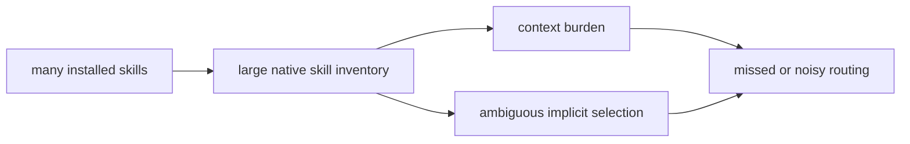
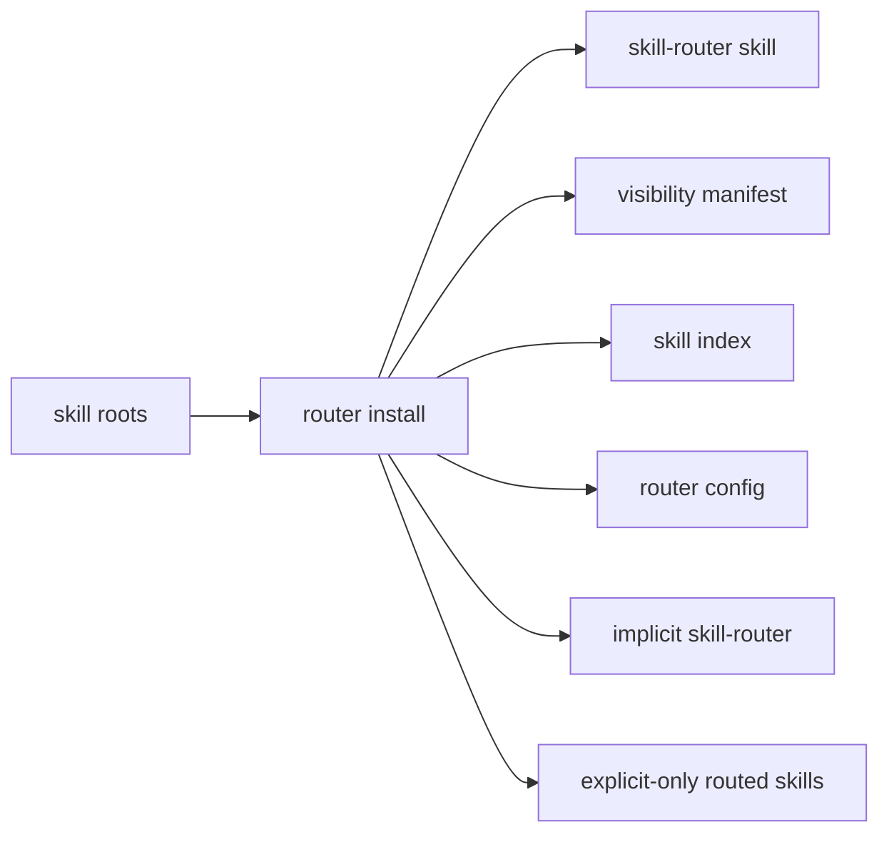
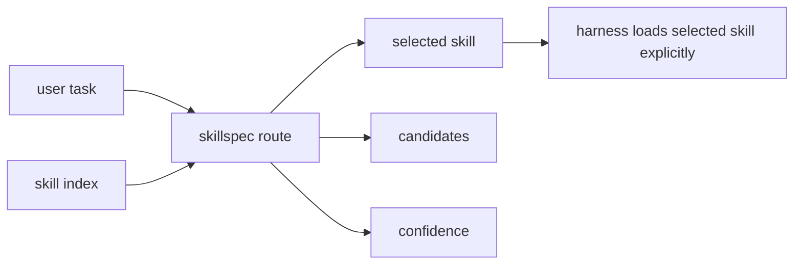
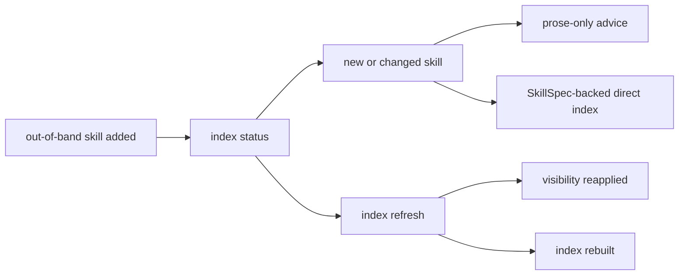
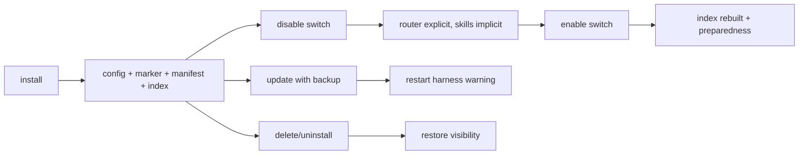

# Router Mode

Router mode is the answer to skill explosion. It lets a workspace keep many
skills installed without loading every skill description into the prompt as an
implicit candidate.

## Context Burden Reduced

Router mode moves skill discovery out of the prompt and into a local catalog:

- installed skills remain on disk;
- native implicit discovery is narrowed;
- route ranking happens against `skill-index.sqlite`;
- the prompt receives selected skill handles and candidates, not every skill
  description.

The top-level `skillspec index` command only builds that router catalog. It is
not source analysis, workspace recon, or skill import. If router mode is
disabled, direct `skillspec index` can rewrite the catalog, but it will not make
the router implicit or affect implicit skill selection until `skillspec router
enable` runs.

## 1. The Problem

Without router mode, more skills means more context pressure and more ambiguous
native skill selection.



Review check:

- The problem is not that skills are bad.
- The problem is uncontrolled implicit discovery at scale.

## 2. Router Install Changes Visibility

Router install creates a managed router skill, applies native visibility
controls, builds an index, and records a reversible manifest.



Grounded command:

```sh
skillspec router install \
  --roots <skill-root>... \
  --index <router-index>
```

Review check:

- Router skill is generated in each configured root.
- Router config records managed roots and router skill dirs.
- Visibility is manifest-backed for restore.
- After harness restart, the router is the implicit first hop for every request
  in managed roots.
- Routed skills are explicit-only/manual-only and should be loaded only after
  router selection.
- `durable-executor` remains implicit only when installed and enabled.

This is the strongest guarantee SkillSpec can make at the skill layer: the
router is favored by native visibility metadata, not merely by description text.
It applies to configured roots after install/enable and harness restart. It does
not cover skills outside those roots or harness sessions that have not reloaded
their skill metadata.

## 3. Runtime Routing Uses The Index

The router is a discovery first-hop, not an execution envelope. It ranks
candidates from the local index and returns the selected skill path plus
candidates and confidence. If the router finds no suitable skill, the agent
continues with the normal path for the request instead of loading an unrelated
skill.



Grounded command:

```sh
skillspec route \
  --index <router-index> \
  --query '<user task>' \
  --json
```

Review check:

- Router chooses; it does not perform the selected skill's task.
- The selected skill still owns its own SkillSpec or prose contract.
- Durable execution remains a separate execution policy.

## 4. Out-Of-Band Skills Are Repaired

Skills can be added outside `skillspec install skill`. Router mode detects and
repairs that drift.



Grounded commands:

```sh
skillspec router index status --roots <skill-root>... --index <router-index> --json
skillspec router index refresh --roots <skill-root>... --index <router-index> --json
```

Review check:

- Status is read-only.
- Refresh reapplies explicit-only controls only when router mode is enabled.
- Prose-only skills are indexed but receive conversion advice.
- Missing skills are reported as drift instead of silently ignored.

## 5. Router Has Its Own Lifecycle

Router mode is managed state, not a loose folder copy.



Grounded commands:

```sh
skillspec status --json
skillspec router disable --json
skillspec router enable --json
skillspec router update --json
skillspec router guard --json
skillspec router delete --json
```

Review check:

- Disable does not uninstall; it removes managed guard hooks, makes router explicit-only, and makes routed skills implicit/default.
- Enable reinstalls managed guard hooks, rebuilds the index from current roots, and checks preparedness.
- Guard verifies `first_hop_ready` and repairs stale visibility/index drift before a prompt hook allows the turn.
- Status is read-only; it reports lifecycle state, supported/scanned roots, router index freshness, and SkillSpec-backed versus legacy skill inventory without repairing visibility or rebuilding the index.
- Update starts from saved router config.
- Delete removes only generated router skills with the managed marker.
- Active harness sessions should restart after mutation.

## What This Workflow Does Not Do

- It does not execute the selected skill's work.
- It does not silently install durable-executor.
- It does not delete ordinary skills.
- It does not make hidden skills unavailable for explicit invocation.

## Mental Model

Router mode turns a growing skill library into an explicit catalog. It reduces
context burden by moving discovery out of the prompt and into a local index.
