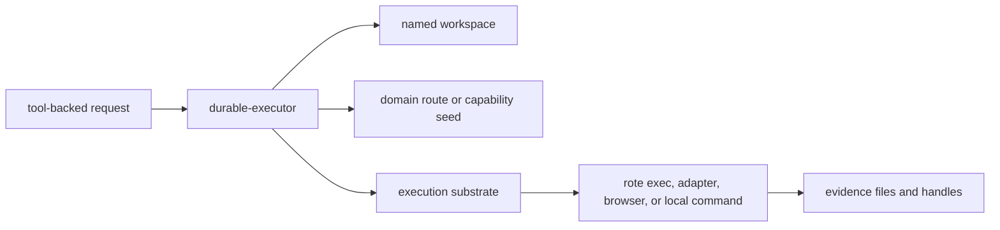
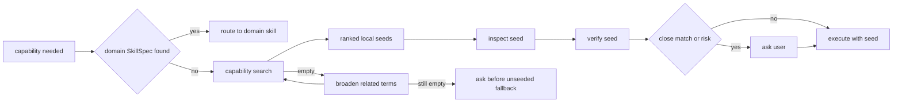
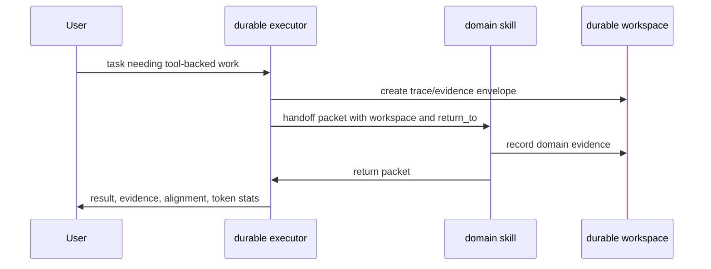
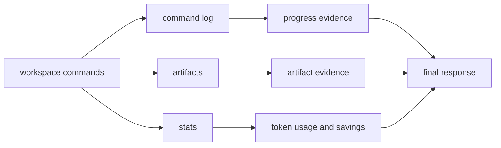
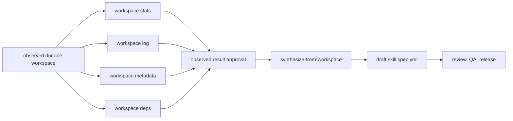
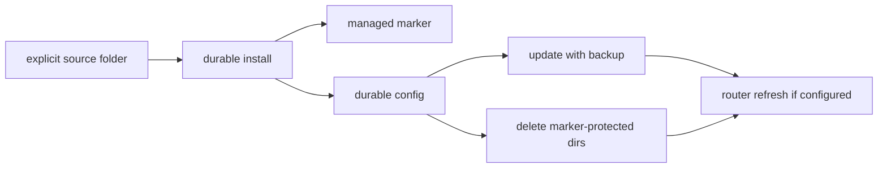

# Durable Executor

Durable-executor is the optional first-hop for tool-backed work. It exists so
work that uses CLIs, adapters, browsers, local processes, files, or external
services can leave durable evidence instead of disappearing into chat scrollback.

## Context Burden Reduced

Durable-executor moves execution state out of the prompt and into a named
workspace:

- command logs become workspace records;
- artifacts become files or handles;
- local capability seeds replace ad hoc tool memory;
- token stats are collected as evidence;
- final answers carry compact references instead of full transcripts.

## 1. First Hop For Tool-Backed Work

When a request needs durable execution, durable-executor owns the workspace,
substrate selection, evidence, alignment, token stats, and closure.



Review check:

- The workspace is named.
- Tool output is captured as evidence.
- Work does not rely on untracked stdout as proof.

## 2. Capability Seeds Before Fallback

When no reviewed domain SkillSpec owns a needed capability, durable-executor can
consult the local capability seed store before falling back to an unseeded local
tool. The seed records live outside the durable-executor skill, under
`~/.skillspec/capabilities/<domain>/<seed-id>.yml`.



Grounded commands:

```sh
skillspec capability store
skillspec capability search <capability> --domain <domain> --explain --json
skillspec capability inspect <seed-id> --domain <domain> --json
skillspec capability verify <seed-id> --domain <domain> --json
skillspec capability update <seed-id> --domain <domain> --mark-failed
skillspec capability prefer <seed-id> \
  --domain <domain> \
  --for <capability> \
  --priority <0-100>
```

Review check:

- A seed is not a SkillSpec and not a handoff target.
- The agent searches, inspects, and verifies the seed before relying on it.
- Empty first search broadens to related capability and domain terms before
  fallback.
- Unseeded local fallback requires an explicit ask or a created and verified
  seed.
- Failed seeds are marked failed or lowered in priority before replacement.

## 3. Durable Handoff To Domain Skills

Durable-executor can hand off domain interpretation to another skill while
preserving the durable packet.



Review check:

- `workspace`, `trace_dir`, `return_to`, and execution policy are preserved.
- Domain skill owns domain interpretation.
- Durable-executor owns durable closure.

## 4. Evidence And Token Reporting

Durable work should end with a compact report whose detailed evidence can be
retrieved from the workspace instead of reloaded into prompt context.



Grounded commands:

```sh
rote workspace stats <workspace>
skillspec progress stats <run-dir> \
  --workspace <workspace> \
  --workspace-stats-report <file>
skillspec trace align <spec> \
  --decision-trace <run-dir> \
  --execution-trace <run-dir>/execution.jsonl \
  --summary
```

Review check:

- Token usage is measured or explicitly marked not recorded.
- Evidence refs point to workspace files, response ids, or artifacts.
- Alignment can be partial when proof is missing.
- Final response summarizes evidence instead of reloading the full workspace.

## 5. Observed Work Can Become A Skill

SkillSpec can synthesize a draft skill from an observed durable workspace. This
is how a one-off durable workflow becomes a reusable SkillSpec-backed skill.



Grounded command:

```sh
skillspec synthesize-from-workspace <workspace> \
  --task '<observed task>' \
  --out <skill-folder> \
  --observation-approved
```

Review check:

- Synthesis depends on real workspace evidence.
- The observed result and evidence summary must be shown and approved before
  synthesis writes a scaffold.
- If live rote workspace lookup fails, capture stats, log, and metadata from
  inside the workspace and pass `--workspace-stats-report`, `--workspace-log`,
  and `--workspace-meta`.
- Inferred behavior is marked for review.
- The resulting draft still needs validation, tests, dependency review, and
  proof before release.

## 6. Durable Has A Managed Lifecycle

Durable-executor is optional. It is not silently installed by router mode, and it
has its own lifecycle.



Grounded commands:

```sh
skillspec durable-executor install <source-folder> --target <target> --json
skillspec durable-executor disable --json
skillspec durable-executor enable --json
skillspec durable-executor update --json
skillspec durable-executor delete --json
```

Review check:

- Install requires an explicit local durable-executor source folder.
- Install, update, and enable preflight that `rote` is available on `PATH`;
  dry-run reports the preflight without writing files.
- Disable does not uninstall; it makes recorded durable installs explicit-only.
- Enable makes recorded durable installs implicit again.
- Update refuses existing unmarked folders.
- Delete removes only recorded marker-protected installs.
- Router state refreshes when router mode is configured.

## What This Workflow Does Not Do

- It does not replace domain skills.
- It does not treat a capability seed as a reviewed domain SkillSpec.
- It does not use an unseeded local tool before the fallback ask or seed
  verification gate.
- It does not make untracked stdout into proof.
- It does not install itself through router mode.
- It does not delete unmarked durable-executor folders.

## Mental Model

Durable-executor reduces context burden by moving execution evidence, command
history, capability seed selection, and token accounting into named records. The
prompt carries handles and summaries, not the whole execution transcript.
