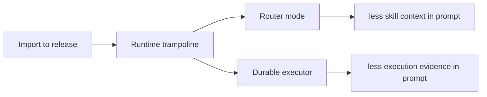

# SkillSpec Visual Explainers

This folder is the visual, narrative layer for SkillSpec. The numbered design
docs in `docs/design/` explain the contract in detail; these explainers show the
same ideas as small workflow diagrams that can be read independently.

Use this folder when someone needs to understand the shape of the system before
reading the full design docs.

## One-Screen Map



The first two explain the lifecycle of one SkillSpec-backed skill. The last two
explain how SkillSpec scales when many skills or tool-backed executions enter
the picture.

## Reading Order

| Order | Explainer | Use It To Explain |
| --- | --- | --- |
| 01 | [Import To Release](01-import-to-release.md) | How a prose skill becomes a reviewed, tested, releasable SkillSpec-backed skill without loading the entire source or spec into context. |
| 02 | [Runtime Trampoline And Alignment](02-runtime-trampoline-and-alignment.md) | How the thin `SKILL.md` loader keeps the agent inside `skill.spec.yml`, then uses `plan`, `act`, progress evidence, quiet trace alignment, and proof-digest batching as an OODA loop. |
| 03 | [Router Mode](03-router-mode.md) | How router mode controls skill explosion with an implicit router, explicit-only routed skills, read-only status, reversible enable/disable switches, and a rebuilt index. |
| 04 | [Durable Executor](04-durable-executor.md) | How durable-executor acts as the optional first-hop for tool-backed work, preserving evidence, token stats, reusable workspace history, and local capability seeds. |

## How These Fit The Main Docs

Start here for quick explanation, then read the deeper design doc:

| Visual Topic | Deeper Design Docs |
| --- | --- |
| Import, source maps, scaffolding, release gates | `04-skill-authoring-lifecycle.md`, `18-source-map-progressive-reader.md`, `08-imports-resources-code-and-recipes.md`, `17-qa-process.md` |
| Trampoline loader, OODA loop, progress, alignment | `03-package-anatomy.md`, `10-runtime-plan-act-progress-loop.md`, `11-execution-progress-ledger.md`, `12-traces-and-alignment.md`, `13-completion-alignment-and-token-reporting.md` |
| Router mode and skill catalog control | `14-skill-router.md`, `16-command-log.md` |
| Durable execution, capability seeds, and fallback | `15-capability-bootstrap.md`, `16-command-log.md`, `12-traces-and-alignment.md`, `13-completion-alignment-and-token-reporting.md` |

## Visual Style

Each explainer uses several small diagrams instead of one large architecture
diagram. The intended review loop is:

```text
author one small diagram
-> check whether each box maps to an implemented command or contract
-> fix wording and missing gates
-> move to the next diagram
```

If a diagram cannot be tied back to implementation, reference docs, or tests, it
does not belong here.

## Naming Rule

The file names describe the user-visible workflow, not internal modules:

- `import-to-release`: the authoring path from prose to a reviewed skill.
- `runtime-trampoline-and-alignment`: the installed-skill execution path.
- `router-mode`: catalog and visibility control for many skills.
- `durable-executor`: evidence-preserving first-hop execution and capability
  seed fallback.
