# SkillSpec v0 Grammar Atlas

This is the visual companion to the formal grammar (`schema: skillspec/v0`).
Each plate is a standalone SVG that renders inline on GitHub. Together they
cover the type schema, the reference graph, behavioral semantics, and a worked
example.

SkillSpec v0 is a structured skill contract — routes, rules, elicitations, states, commands, imports, resources, code, artifacts, recipes, tests, and proof hooks — deliberately *not* an execution engine.

Read this alongside [`../../spec/grammar.md`](../../spec/grammar.md). The
formal grammar, schema, Rust model, parser, and conformance fixtures are the
source of truth; this atlas is explanatory.

## Notation

| Glyph | Meaning |
|---|---|
| `●` | required field |
| `○` | optional field |
| `→ Type` | symbolic reference to another object type / id |
| `▾` | enum / terminal value set |
| `⊻ exactly one of` | mutually exclusive fields — provide exactly one |
| `seq<…>` | repeated (0+) |
| `nested` | composite (non-terminal) type |
| `enum` | closed scalar set (terminal) |

Identifiers are stable API: human labels can change, ids should not churn.

## Plates

### Overview

Title, notation key, full document order (22 sections), and the atlas table of contents.

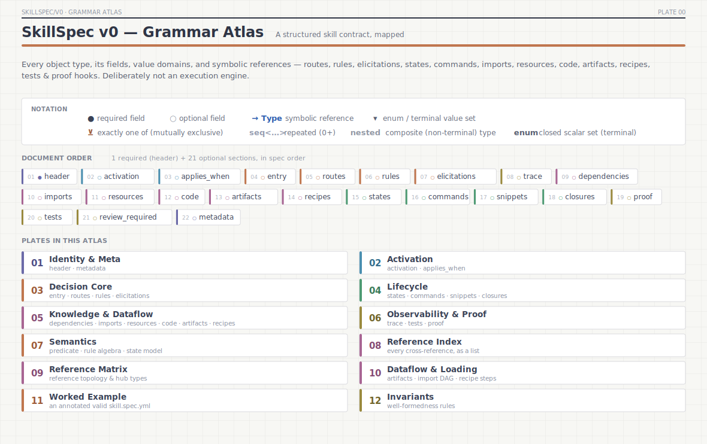

### Identity & Meta

`header` (the one required section) and the open `metadata` surface.

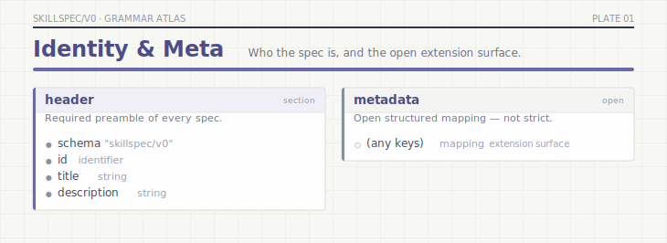

### Activation

`activation` and `applies_when` — advisory harness-selection hints that never decide routing.

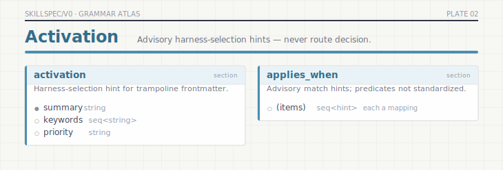

### Decision Core

`entry`, `route`, `rule`, `elicitation` and nested types — how work is steered.

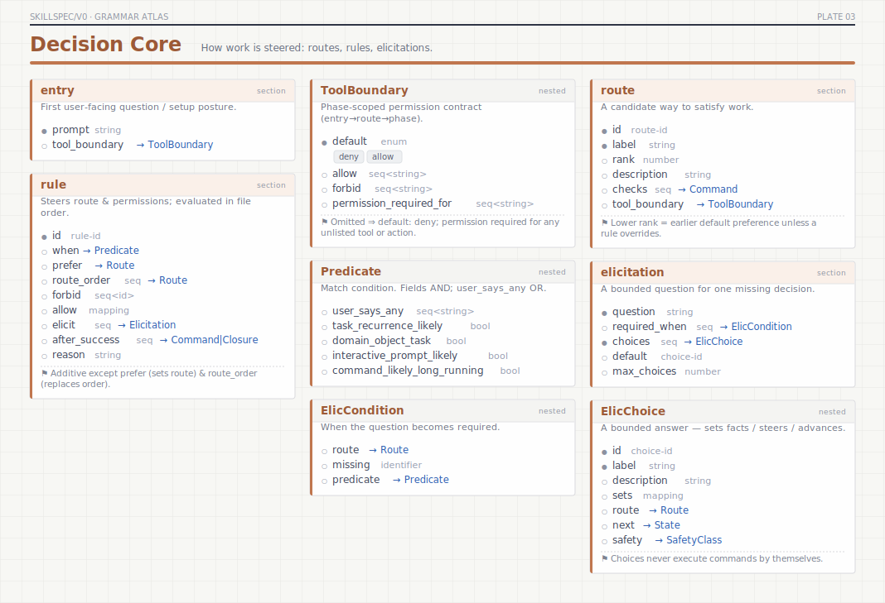

### Lifecycle

`state`, `command`, `snippet`, `closures`, and the `SafetyClass` enum.

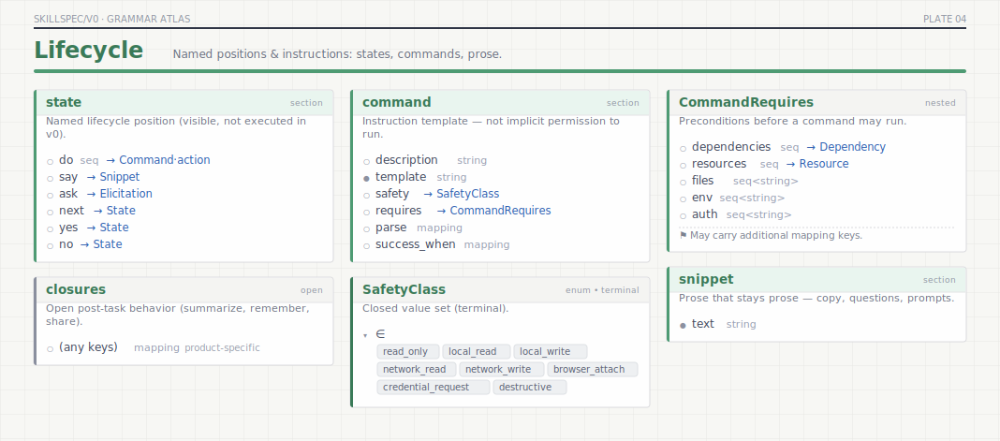

### Knowledge & Dataflow

`dependency`, `import`, `resource`, `code`, `artifact`, `recipe` and every nested type. Note the `⊻ exactly one of` brackets on `CodeSource`, `CodeProvenance`, and `RecipeStep`.

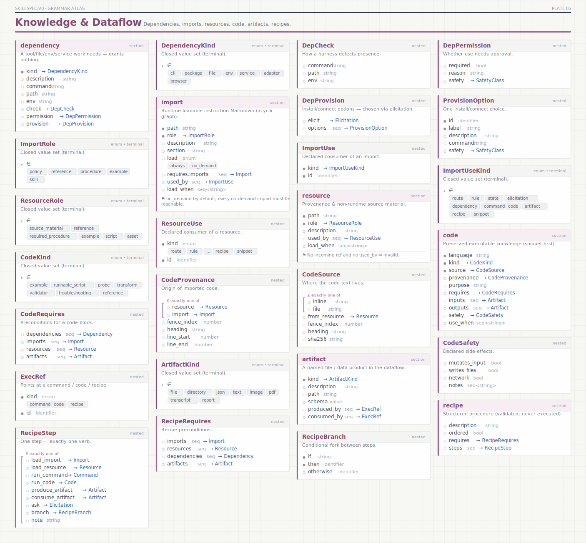

### Observability & Proof

`trace`, `test`, `proof`, `review_required`, and the trace-event enum.

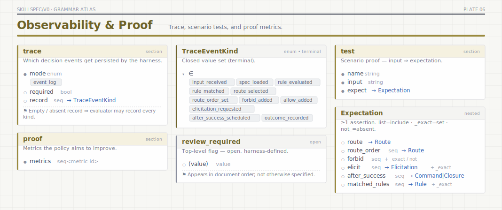

### Semantics

Predicate AND/OR composition, the rule-effect fold, and the `next/yes/no` state model.

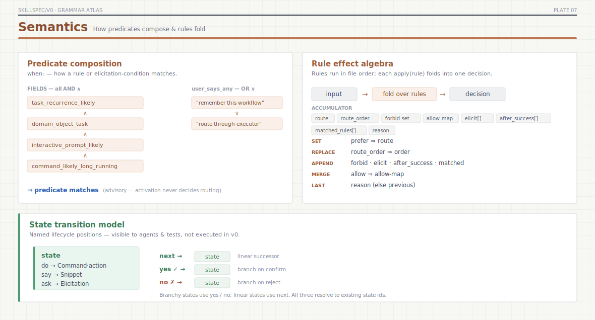

### Reference Index

Every `source.field → target` cross-reference, grouped by source type (the readable list form).

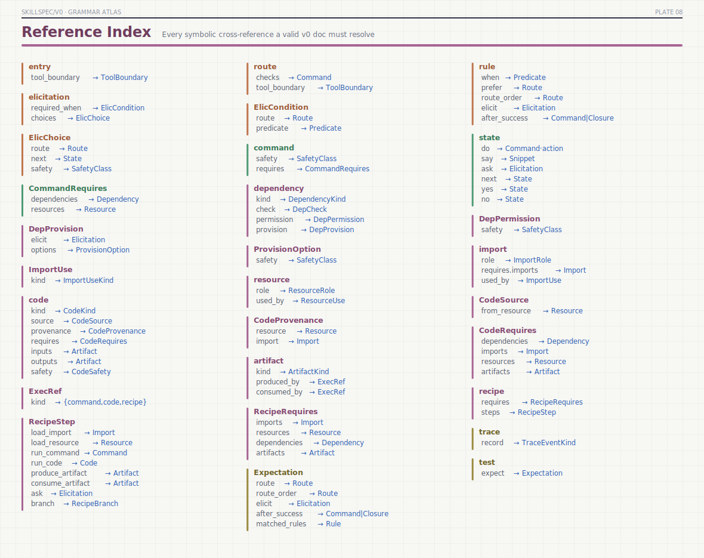

### Reference Matrix

The reference graph as an adjacency matrix: rows reference columns, dot colour = source subsystem, in-degree bars mark **hub types** (Resource, Command, Elicitation, Import, Route, SafetyClass, Artifact, Dependency).

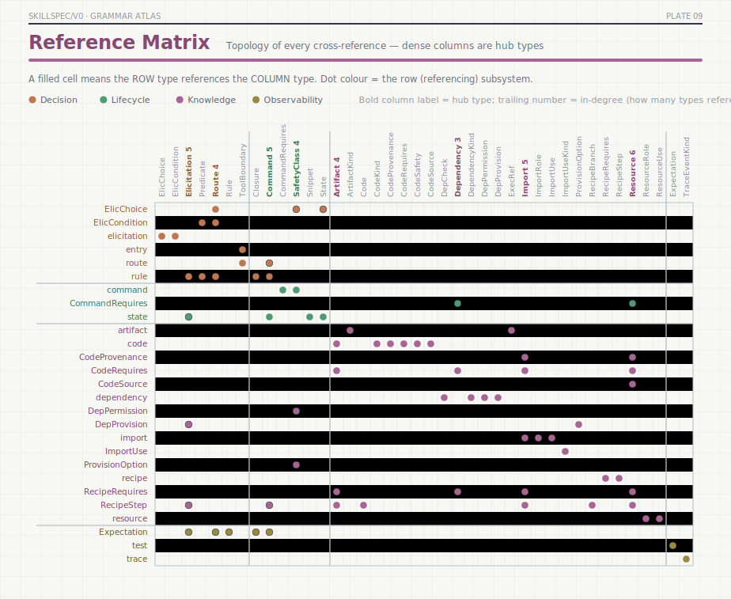

### Dataflow & Loading

Artifact producer/consumer flow, the import/resource loading model, the `requires.imports` DAG, and the recipe-step verbs.

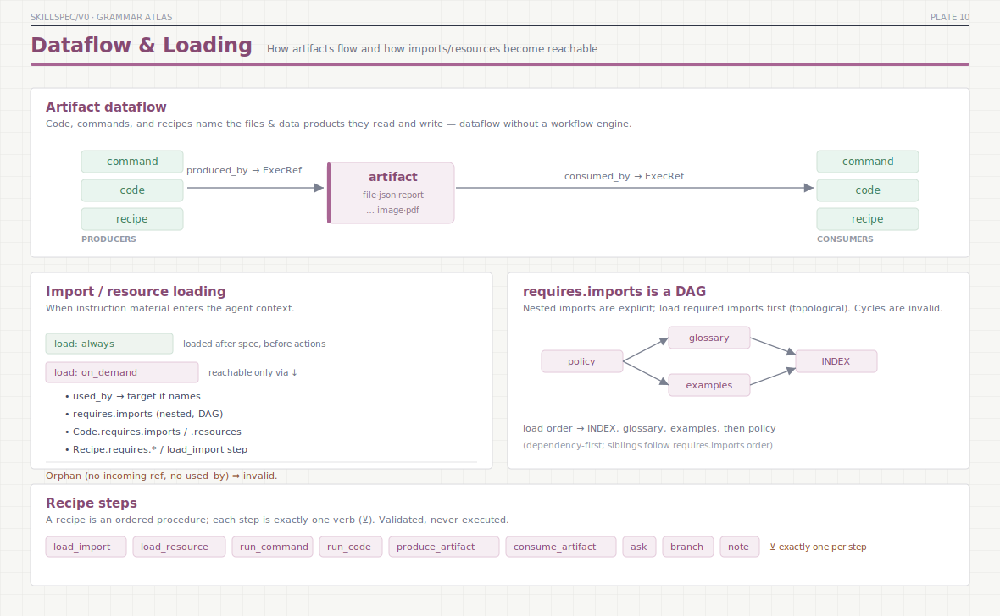

### Worked Example

One valid `skill.spec.yml`, fully annotated; arcs link each reference to the definition it resolves to.

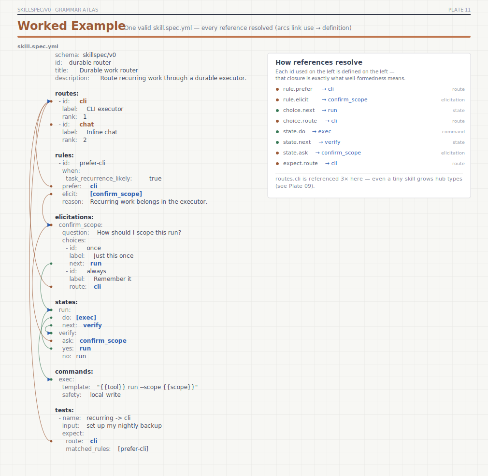

### Invariants

Well-formedness rules beyond field references (DAG acyclicity, orphan checks, exactly-one constraints, strict unknown-field rejection).

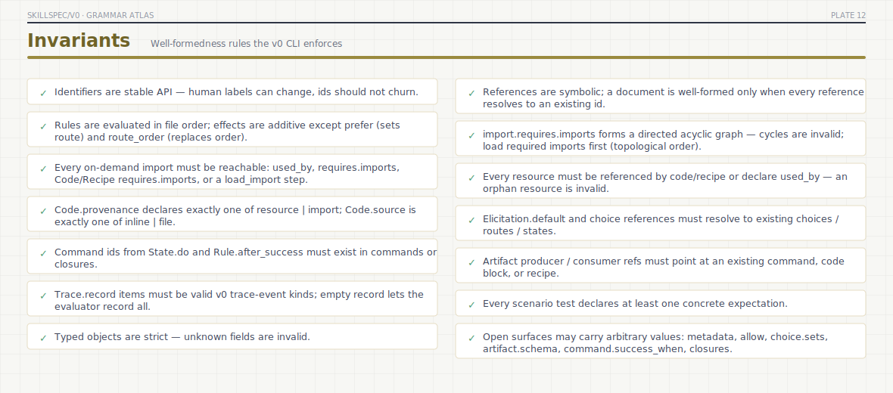

## Symbolic reference index (text)

Greppable form of Plates 08–09 — the cross-references a well-formed v0 document must resolve.

| Source | Field | → Target |
|---|---|---|
| `entry` | `tool_boundary` | `ToolBoundary` |
| `route` | `checks` | `Command` |
| `route` | `tool_boundary` | `ToolBoundary` |
| `rule` | `when` | `Predicate` |
| `rule` | `prefer` | `Route` |
| `rule` | `route_order` | `Route` |
| `rule` | `elicit` | `Elicitation` |
| `rule` | `after_success` | `Command|Closure` |
| `elicitation` | `required_when` | `ElicCondition` |
| `elicitation` | `choices` | `ElicChoice` |
| `ElicCondition` | `route` | `Route` |
| `ElicCondition` | `predicate` | `Predicate` |
| `ElicChoice` | `route` | `Route` |
| `ElicChoice` | `next` | `State` |
| `ElicChoice` | `safety` | `SafetyClass` |
| `state` | `do` | `Command·action` |
| `state` | `say` | `Snippet` |
| `state` | `ask` | `Elicitation` |
| `state` | `next` | `State` |
| `state` | `yes` | `State` |
| `state` | `no` | `State` |
| `command` | `safety` | `SafetyClass` |
| `command` | `requires` | `CommandRequires` |
| `CommandRequires` | `dependencies` | `Dependency` |
| `CommandRequires` | `resources` | `Resource` |
| `dependency` | `kind` | `DependencyKind` |
| `dependency` | `check` | `DepCheck` |
| `dependency` | `permission` | `DepPermission` |
| `dependency` | `provision` | `DepProvision` |
| `DepPermission` | `safety` | `SafetyClass` |
| `DepProvision` | `elicit` | `Elicitation` |
| `DepProvision` | `options` | `ProvisionOption` |
| `ProvisionOption` | `safety` | `SafetyClass` |
| `import` | `role` | `ImportRole` |
| `import` | `requires.imports` | `Import` |
| `import` | `used_by` | `ImportUse` |
| `ImportUse` | `kind` | `ImportUseKind` |
| `resource` | `role` | `ResourceRole` |
| `resource` | `used_by` | `ResourceUse` |
| `code` | `kind` | `CodeKind` |
| `code` | `source` | `CodeSource` |
| `code` | `provenance` | `CodeProvenance` |
| `code` | `requires` | `CodeRequires` |
| `code` | `inputs` | `Artifact` |
| `code` | `outputs` | `Artifact` |
| `code` | `safety` | `CodeSafety` |
| `CodeSource` | `from_resource` | `Resource` |
| `CodeProvenance` | `resource` | `Resource` |
| `CodeProvenance` | `import` | `Import` |
| `CodeRequires` | `dependencies` | `Dependency` |
| `CodeRequires` | `imports` | `Import` |
| `CodeRequires` | `resources` | `Resource` |
| `CodeRequires` | `artifacts` | `Artifact` |
| `artifact` | `kind` | `ArtifactKind` |
| `artifact` | `produced_by` | `ExecRef` |
| `artifact` | `consumed_by` | `ExecRef` |
| `recipe` | `requires` | `RecipeRequires` |
| `recipe` | `steps` | `RecipeStep` |
| `RecipeRequires` | `imports` | `Import` |
| `RecipeRequires` | `resources` | `Resource` |
| `RecipeRequires` | `dependencies` | `Dependency` |
| `RecipeRequires` | `artifacts` | `Artifact` |
| `RecipeStep` | `load_import` | `Import` |
| `RecipeStep` | `load_resource` | `Resource` |
| `RecipeStep` | `run_command` | `Command` |
| `RecipeStep` | `run_code` | `Code` |
| `RecipeStep` | `produce_artifact` | `Artifact` |
| `RecipeStep` | `consume_artifact` | `Artifact` |
| `RecipeStep` | `ask` | `Elicitation` |
| `RecipeStep` | `branch` | `RecipeBranch` |
| `trace` | `record` | `TraceEventKind` |
| `test` | `expect` | `Expectation` |
| `Expectation` | `route` | `Route` |
| `Expectation` | `route_order` | `Route` |
| `Expectation` | `elicit` | `Elicitation` |
| `Expectation` | `after_success` | `Command|Closure` |
| `Expectation` | `matched_rules` | `Rule` |

## Well-formedness invariants (text)

- Identifiers are stable API — human labels can change, ids should not churn.
- References are symbolic; a document is well-formed only when every reference resolves to an existing id.
- Rules are evaluated in file order; effects are additive except prefer (sets route) and route_order (replaces order).
- import.requires.imports forms a directed acyclic graph — cycles are invalid; load required imports first (topological order).
- Every on-demand import must be reachable: used_by, requires.imports, Code/Recipe requires.imports, or a load_import step.
- Every resource must be referenced by code/recipe or declare used_by — an orphan resource is invalid.
- Code.provenance declares exactly one of resource | import; Code.source is exactly one of inline | file.
- Elicitation.default and choice references must resolve to existing choices / routes / states.
- Command ids from State.do and Rule.after_success must exist in commands or closures.
- Artifact producer / consumer refs must point at an existing command, code block, or recipe.
- Trace.record items must be valid v0 trace-event kinds; empty record lets the evaluator record all.
- Every scenario test declares at least one concrete expectation.
- Typed objects are strict — unknown fields are invalid.
- Open surfaces may carry arbitrary values: metadata, allow, choice.sets, artifact.schema, command.success_when, closures.

---

*Plates are generated SVGs with hex colours and system-font fallbacks so they
render in GitHub.*
