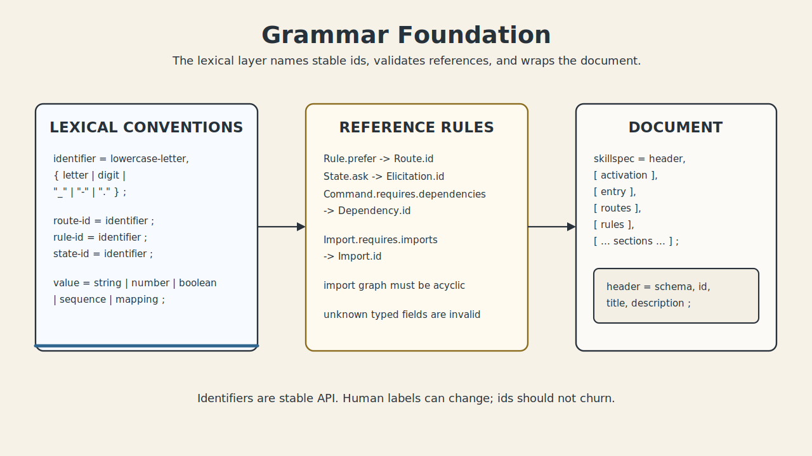
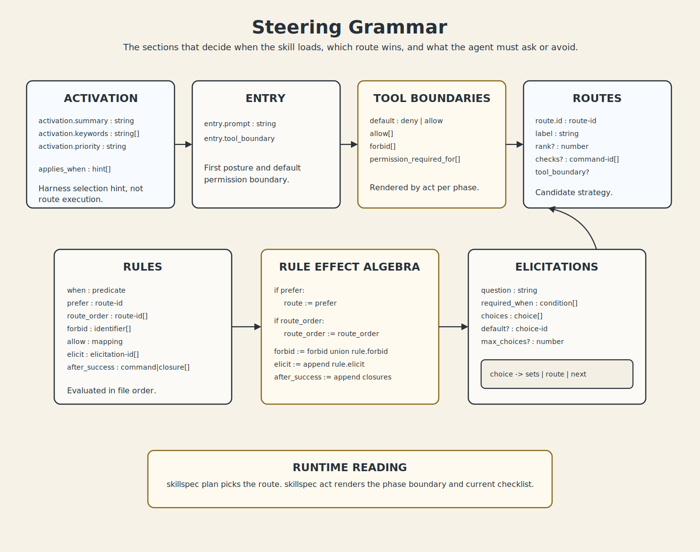
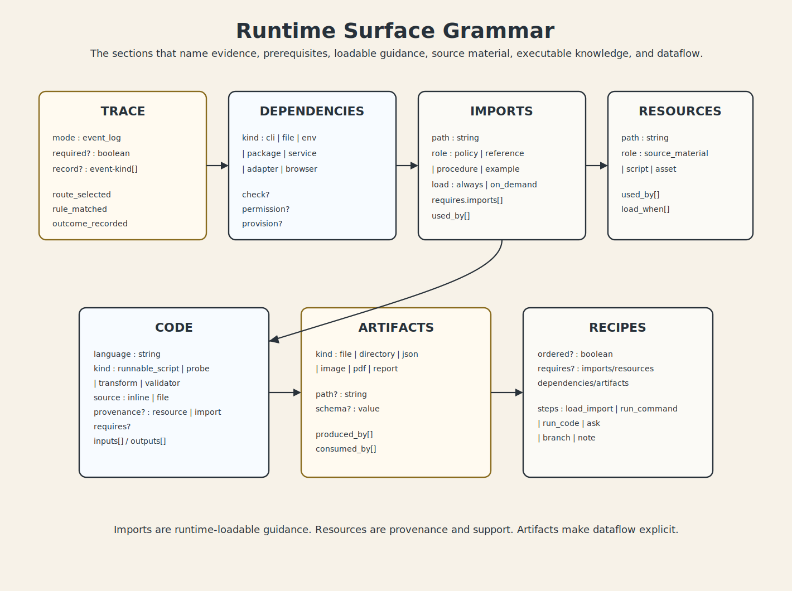
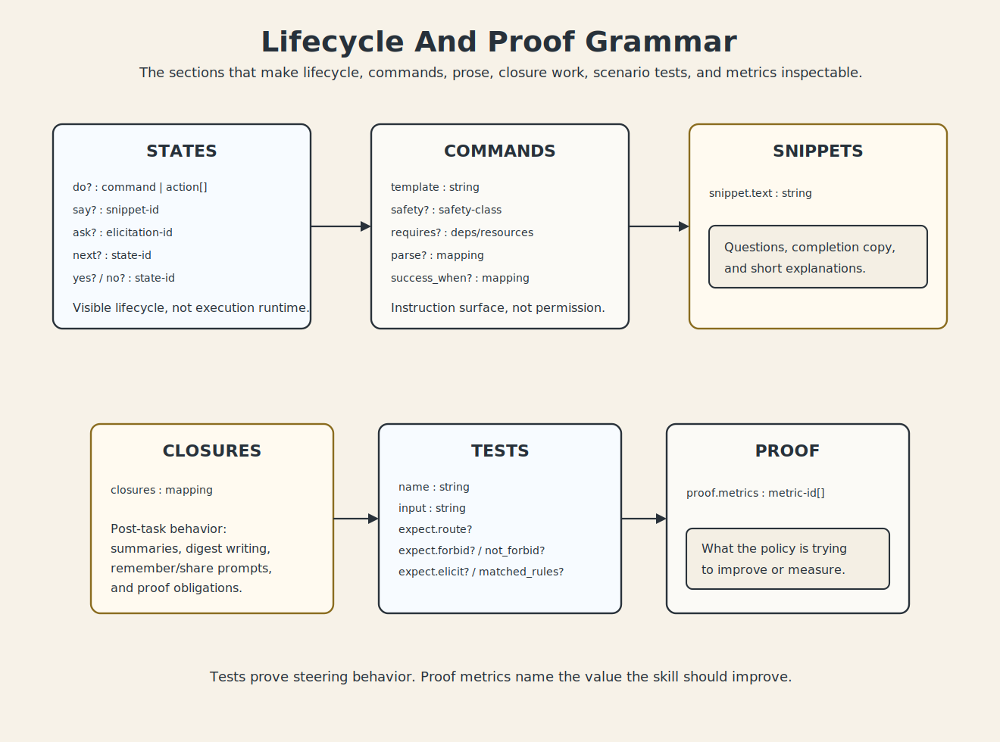

# SkillSpec Grammar Visuals

This page is a visual companion to [`spec/grammar.md`](../spec/grammar.md).
It does not redefine the grammar. It turns the current top-level grammar
sections into inspectable lexical cards so authors, reviewers, and harness
builders can see the shape of the contract quickly.

Use the formal grammar when precision matters. Use these diagrams when you need
to orient before editing or reviewing a `skill.spec.yml`.

## Foundation

Lexical conventions, reference rules, and the top-level document envelope.

Covered sections:

- [`Lexical Conventions`](../spec/grammar.md#lexical-conventions)
- [`Reference Rules`](../spec/grammar.md#reference-rules)
- [`Document`](../spec/grammar.md#document)

## Steering

How the spec selects the skill, presents the first posture, chooses routes,
applies rules, asks bounded questions, and renders tool boundaries.

Covered sections:

- [`Activation`](../spec/grammar.md#activation)
- [`Entry`](../spec/grammar.md#entry)
- [`Tool Boundaries`](../spec/grammar.md#tool-boundaries)
- [`Routes`](../spec/grammar.md#routes)
- [`Rules`](../spec/grammar.md#rules)
- [`Rule Effect Algebra`](../spec/grammar.md#rule-effect-algebra)
- [`Elicitations`](../spec/grammar.md#elicitations)

## Runtime Surface

How the spec names proof events, dependencies, imports, resources, code,
artifacts, and recipes without becoming a general execution engine.

Covered sections:

- [`Trace`](../spec/grammar.md#trace)
- [`Dependencies`](../spec/grammar.md#dependencies)
- [`Imports`](../spec/grammar.md#imports)
- [`Resources`](../spec/grammar.md#resources)
- [`Code`](../spec/grammar.md#code)
- [`Artifacts`](../spec/grammar.md#artifacts)
- [`Recipes`](../spec/grammar.md#recipes)

## Lifecycle And Proof

How the spec describes lifecycle positions, command templates, prose snippets,
post-task closures, scenario tests, and proof metrics.

Covered sections:

- [`States`](../spec/grammar.md#states)
- [`Commands`](../spec/grammar.md#commands)
- [`Snippets`](../spec/grammar.md#snippets)
- [`Closures`](../spec/grammar.md#closures)
- [`Tests`](../spec/grammar.md#tests)
- [`Proof`](../spec/grammar.md#proof)

